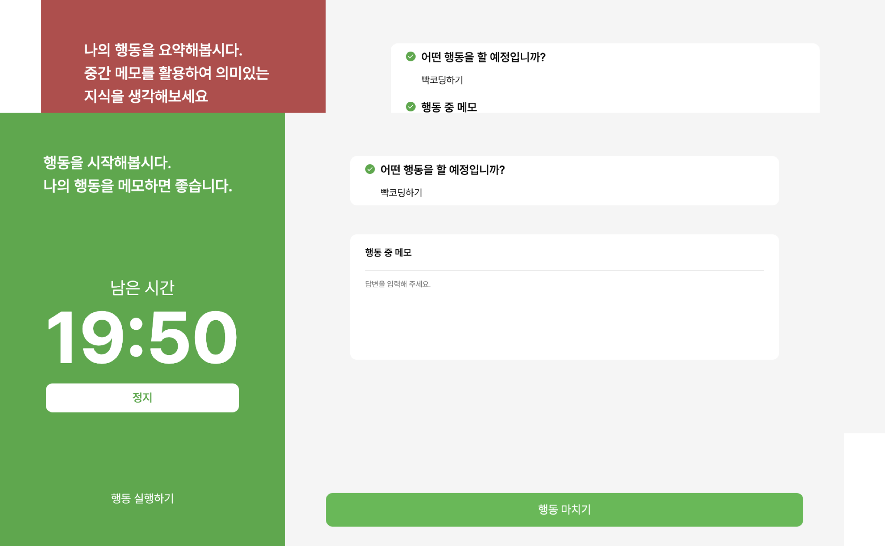
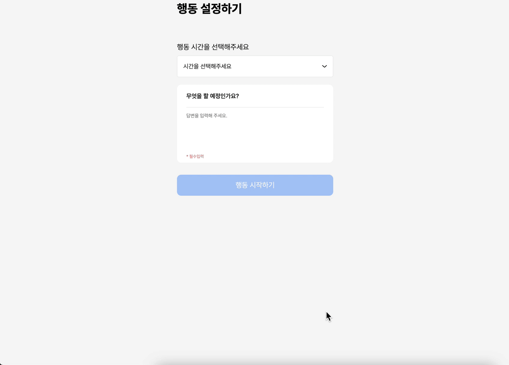
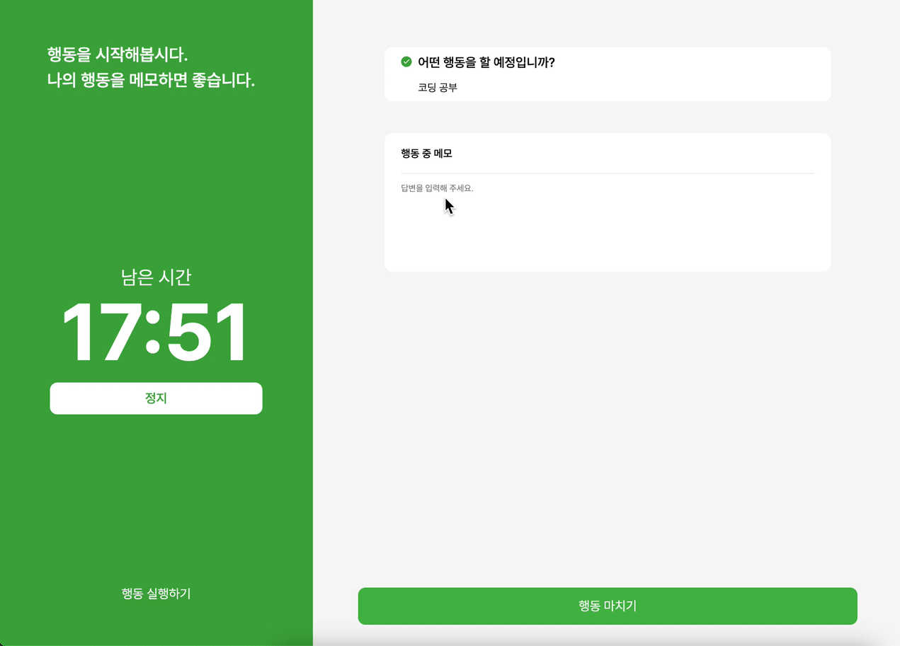
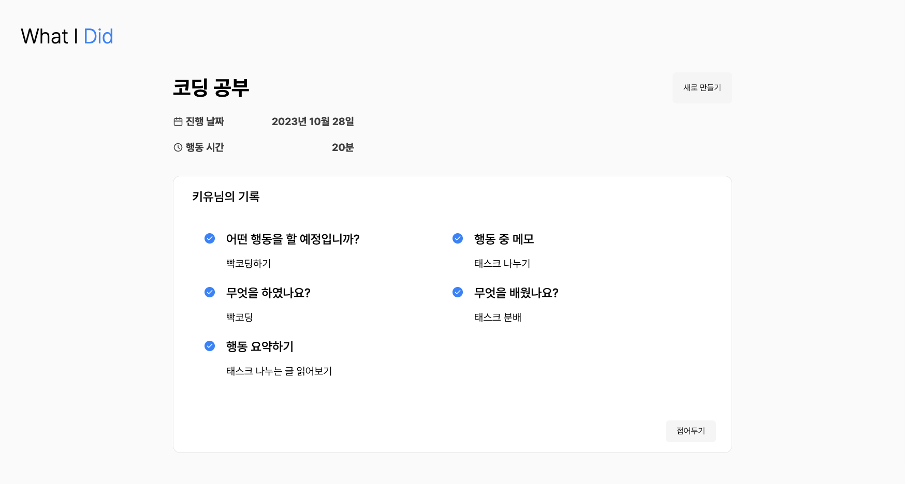
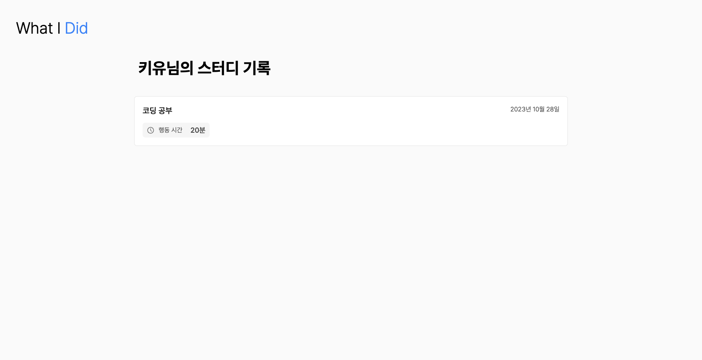

🔗 서비스 링크 : https://whatidid.netlify.app/

# 💬 서비스 소개

메모를 하는 습관은 중요합니다.
일정시간동안의 자신의 행동을 5분간 요약하고 배운 것을 정리하는 방식은 필요합니다.

**What I Did**는 당신의 행동을 요약하고 정리하는 습관에 도움이 될 것입니다.

# 🛠️ 기술스택

- React
- Typescript

# 구현사항

- localStorage를 이용한 사용자 정보 기록
- custom hook으로 비즈니스 로직 분리
- Context API로 페이지별, 서비스별 상태 관리

# ✏️ 사용방법

## STEP 1

자신의 행동 시간과 예정 행동을 설정해 보세요.

## STEP 2 & 3

- 행동하는 동안 메모를 적고 행동이 종료되면 행동을 요약해보세요.
- 행동 중 브라우저를 종료해도 행동시간이 종료되지 않았다면 계속 이어갈 수 있습니다.

## STEP 4

지금까지의 행동을 관리하세요.

